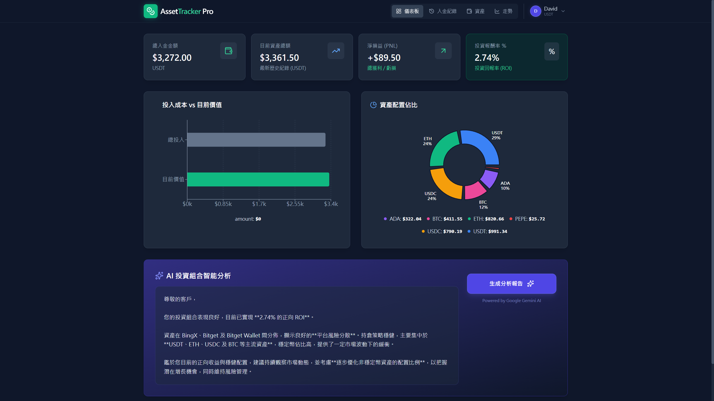

# AssetTracker-Pro

<div align="center">
  
</div>

## 概述

**AssetTracker-Pro** 是一款功能強大的資產管理應用程式，旨在幫助用戶追蹤多個平台上的投資、存款和餘額。它擁有使用者友好的介面和穩健的數據持久化功能，確保您的財務數據隨時可用。

### 主要功能
- **多平台支持**：追蹤 BingX、Bitget 等平台上的資產。
- **即時更新**：存款、餘額和歷史記錄的變更即時反映。
- **數據持久化**：所有數據都安全地存儲在本地的 `data/appData.json` 中，支持離線訪問。
- **互動式儀表板**：使用餅圖和詳細的數據分解來可視化您的資產分配。

## 快速開始

### 先決條件
- **Node.js 18+**

### 安裝步驟
1. 克隆此倉庫：
   ```bash
   git clone https://github.com/dfg47ofgt/AssetTracker-Pro.git
   ```
2. 進入專案目錄：
   ```bash
   cd AssetTracker-Pro
   ```
3. 安裝依賴：
   ```bash
   npm install
   ```

### 配置
1. 在根目錄創建 `.env` 文件。
2. 添加您的 Gemini API 金鑰：
   ```env
   GEMINI_API_KEY='your_gemini_api_key_here'
   ```

### 啟動應用
啟動開發伺服器：
```bash
npm run dev
```

應用將可通過 `http://localhost:3000` 訪問。

## 數據持久化
- **文件位置**：所有運行時數據存儲在 `data/appData.json` 中。
- **自動初始化**：如果文件丟失，應用會自動初始化該文件。
- **備份**：提交或備份該文件以保留您的數據集。

## 文件結構
```
AssetTracker-Pro/
├── components/         # React 組件
├── services/           # API 和服務邏輯
├── data/               # 本地數據存儲
├── assets/             # 靜態資源（如圖片）
├── App.tsx             # 主應用入口
├── vite.config.ts      # Vite 配置
```

## 貢獻
歡迎貢獻！請 fork 此倉庫並提交 pull request。

## 授權
此專案基於 MIT 許可證。
